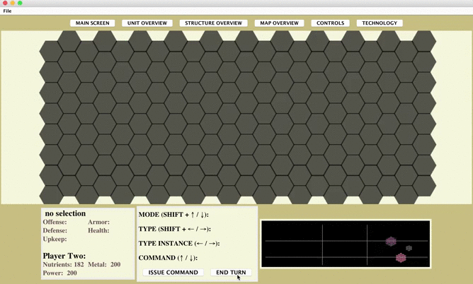

# Space Wars: Iteration 2
OOP Turn-Based Strategy Game

<!--[Iteration 1 requirements](demo/Iteration1_Requirements.pdf)-->

## Compile and run the source code

```javascript
git clone -b technology --single-branch git://github.com/COP4331-Team7/Sprint2
cd Sprint2
find ./src/* | grep .java > argfile
javac @argfile
java -cp src com.team7.Main
```

## Download and run a JAR file containing the packaged Java app
Click [here](Sprint1.jar) or use the UNIX/Linux command *wget* to download the JAR file:
 
```javascript
wget "https://raw.githubusercontent.com/COP4331-Team7/Sprint2/technology/Sprint2.jar" -O Sprint2.jar 
```

Run from the command line or double-click the executable JAR file:
```javascript
java -jar Sprint2.jar 
```

***


### Each player starts with 2 Explorers and a Colonist


<!--


-->
