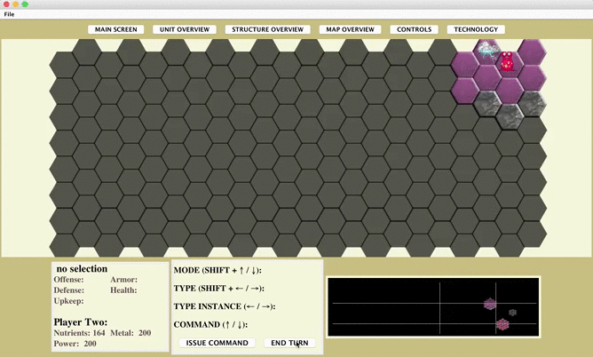

# Space Wars: Iteration 2
OOP Turn-Based Strategy Game

<!--[Iteration 1 requirements](demo/Iteration1_Requirements.pdf)-->

# Running the Game

## Download a JAR file containing the packaged Java application
Click [here](Sprint1.jar) or use the UNIX/Linux command *wget* to download the JAR file:
 
```javascript
wget "https://raw.githubusercontent.com/COP4331-Team7/Sprint2/technology/Sprint2.jar" -O Sprint2.jar 
```
## Run the JAR file (Java Runtime Environment required)
Run from the command line or double-click the executable JAR file:
```javascript
java -jar Sprint2.jar 
```

<!--  -->

### Each player starts with 2 Explorers and 1 Colonist


